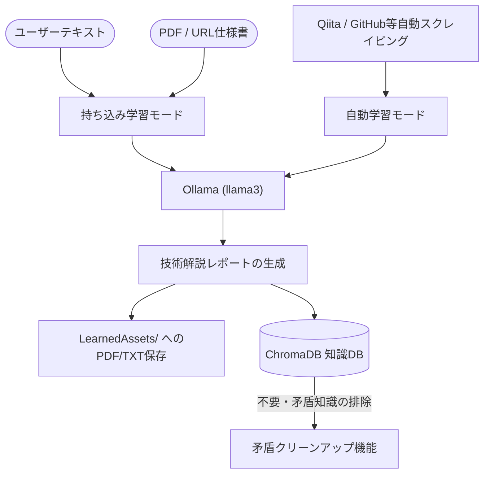

# GameStudio - AI自律型ゲーム開発統合シミュレータ環境 (IDERIA Engine v1.1)

本プロジェクトは、最先端の自律型AIエージェント群を活用してゲーム開発を行う「**開発HUD（Studio Pro Edition）**」と、ゲーム開発技術やライセンス、通信プロトコル等の知識を自律的に学習・蓄積する「**自己学習HUD（Study Edition）**」から構成される、PygameベースのAI自律型ゲーム開発統合シミュレータ環境（IDERIA Engine v1.1）です。

---

## 📐 システムアーキテクチャ (System Architecture)

### 1. 開発HUD (Studio Pro Edition) エージェント協調フロー
開発HUDでは、6人の専門家AIエージェントがバケツリレー形式でタスクを引き継ぎ、仕様策定から実装、自己デバッグ、アートアセット生成、テストまでを完全に自動化します。

```mermaid
graph TD
    User([ユーザープロンプト入力]) --> PM["PM (Project Manager)"]
    PM -->|仕様策定 & map.json設計| Designer["Designer"]
    Designer -->|操作性・演出設計| Programmer["Programmer"]
    Programmer -->|Pygameコード生成| QA["QA (Quality Assurance)"]
    
    subgraph QA_Loop ["QA 自己修復ループ (最大3回)"]
        QA -->|テスト起動 (3秒間)| TestRun{"実行例外の検証"}
        TestRun -->|エラー発生| FixReq["Ollama 自動バグ修復"]
        FixReq -->|コード保存| QA
        TestRun -->|エラーなし| QA_Success["テスト合格"]
    end
    
    QA_Success --> VisualCritic["VisualCritic"]
    VisualCritic -->|アセット・UI批評 & Pillow生成| Tester["Tester"]
    Tester -->|テストケース定義| End([完成 & game_manager.py 保存])

    QA_Loop -->|バグ & 修正履歴の記録| RAG[(ChromaDB RAG)]
    QA_Success -->|チェックポイント保存| TM[(TimeMachine / Git)]
```

### 2. 自己学習HUD (Study Edition) ナレッジ蓄積フロー
自己学習HUDは、自動および手動によるインプットから情報を抽出し、Ollama を通じて構造化された技術知識としてローカルに蓄積します。



---

## 🛠️ 各モジュールの設計詳細

### 開発HUD: 6大エージェントの役割
1. **PM (Project Manager)**
   - 要件定義、ゲーム全体の仕様策定を行います。初期位置やオブジェクト情報を `map.json` にシリアライズする基本設計を担当します。
2. **Designer (Game Designer)**
   - ゲーム性、操作方法、演出仕様を詳細に設計し、プログラマーへ指示します。
3. **Programmer (Lead Pygame Dev)**
   - Pygameを用いた完全な実行可能Pythonスクリプトコードを実装します。アセットは指定の `Assets/Textures/ActiveAsset.png` からロードされるようにコードを構成します。
4. **QA (Quality Assurance)**
   - 生成された `game_manager.py` を実際にサブプロセスとして起動（3秒間）し、実行時例外がないか検証します。エラー発生時はOllamaにバグ内容とコードを送り自動修正を依頼します（最大3回ループ）。
5. **VisualCritic (Art Director)**
   - UIレイアウト、配色、ビジュアルエフェクトの批評を行い、必要に応じてアセット画像の生成や Pillow によるダミー画像生成を調整します。
6. **Tester (Automation Tester)**
   - 動作確認のためのテストケース策定を行い、成果物の安定性を担保します。

### RAG (ChromaDBManager)
- **ベクターDBによる知識ベース**: `chromadb` を利用してローカルの `gamedev_rag` コレクションを管理します。
- **コンテキストの注入 & 呼び出し**: Ollamaがゲームを生成する際に、過去のバグ修正履歴や開発に関する基本ナレッジを RAG コンテキストとして注入し、同様のバグの再発を防ぎます。
- **矛盾知識のクリーンアップ (`clean_contradictions`)**: バージョン変更や矛盾が生じた古いUnityやC++などの不要ナレッジを自動でフィルタリングし削除します。

### タイムマシン機能 (TimeMachine)
- **Git 連動によるチェックポイントセーブ**: ローカル環境に Git があれば自動で `git init` を行い、エージェントの各フェーズ完了時に `git commit` を実行して状態を自動保存します。
- **フォルダバックアップフォールバック**: Git がない環境でも、最大5世代のタイムスタンプ付きバックアップフォルダを生成してロールバックを可能にします。

### P2P & UPnP 通信モジュール
- **P2PConnection**: UDP ソケット（`SOCK_DGRAM`）を用いた軽量なリアルタイム通信クラス。
- **UPnP自動ポート開放**: `miniupnpc` を使用し、ルーターのポートマッピングを自動で設定（ポート開放）します。ルーター越しのP2P型マルチプレイヤー通信やデータ同期をシームレスに実現します。

### ホットリロード & プレビュー埋め込み
- **Tkinter キャンバスへの Pygame ドッキング**: `SDL_WINDOWID` 環境変数を利用して、起動した Pygame のウィンドウを Tkinter の Canvas にシームレスにドッキング表示（プレビュー）させます。
- **watchdog によるファイル監視**: ファイルの変更検知を行うとテストプロセスを自動で再起動し、リアルタイムにプレビューを更新します。

---

## 🚀 使い方と実行手順 (Usage)

### 1. 推奨環境
- **OS**: Windows 10 / 11
- **Python**: 3.10 以上
- **ローカルAI環境**: Ollama が動作しており、`llama3` モデルがプルされていること。

### 2. 依存ライブラリのインストール
以下のコマンドを実行して、必要なパッケージをインストールしてください。
```bash
pip install customtkinter pillow ollama watchdog pygame pygame-menu miniupnpc chromadb
```

### 3. アプリケーションの起動

#### 🎮 開発HUD (Studio Pro Edition) の起動
```bash
python ai_game_studio/studio_pro_edition.py
```
- 起動するとネオン調のサイバーパンク風GUIが立ち上がります。
- 画面中央のテキストボックスに「作成したいゲームのプロンプト」を入力し、**[DAY MODE開始]** ボタンを押下すると、AIエージェントのバケツリレーが開始されます。

#### 📖 自己学習HUD (Study Edition) の起動
```bash
python ai_game_studio/studio_study_edition.py
```
- ユーザー指定のキーワードや、URL、PDF仕様書をドラッグ＆ドロップまたは指定して **[学習開始]** することで、AIがその技術仕様を学習しレポートを作成します。
- 生成されたレポートや資料は、自動的に `LearnedAssets/` ディレクトリに保存されます。

### 4. 実行時の主な機能コントロール

*   **言語切り替え (日本語 / English)**
    *   画面上部の言語切替ボタンから動的にUIを変更可能。英語選択時には、Ollamaへのプロンプトや出力されるソースコード、設計書もすべて英語に変更されます。
*   **軽量モード (Low-spec Mode)**
    *   チェックボックスをオンにすると、重いAIモデルのロードやGPU画像生成をスキップし、Pillowによるダミー画像生成や簡易シミュレータに切り替わります（OllamaのないPCでも一瞬で起動します）。
*   **Ollama接続監視**
    *   起動時に `127.0.0.1:11434` へ0.5秒のタイムアウトで死活確認を行います。接続できない場合は自動で「軽量モード」へとフォールバックします。
*   **緊急停止 (ABORT STUDIO / 学習停止)**
    *   実行中にトラブルが発生した際、強制停止ボタンを押すとバックグラウンドスレッドが安全に遮断され、GPUのVRAMキャッシュがパージ・解放されます。

---

## 📦 ビルド方法 (PyInstallerによるシングルEXE化)

本シミュレータは、PyInstallerを使用してインストーラー不要の単一実行ファイル (.exe) にビルド可能です。

```bash
# 開発HUDのビルド
pyinstaller ai_game_studio/studio_pro_edition.spec

# 自己学習HUDのビルド
pyinstaller ai_game_studio/study_mode.spec
```
※ 各 `.spec` ファイルには `torch` や `diffusers` などの巨大パッケージを除外する `excludes` 設定があらかじめ定義されているため、軽量で高速なシングルexeが生成されます。
