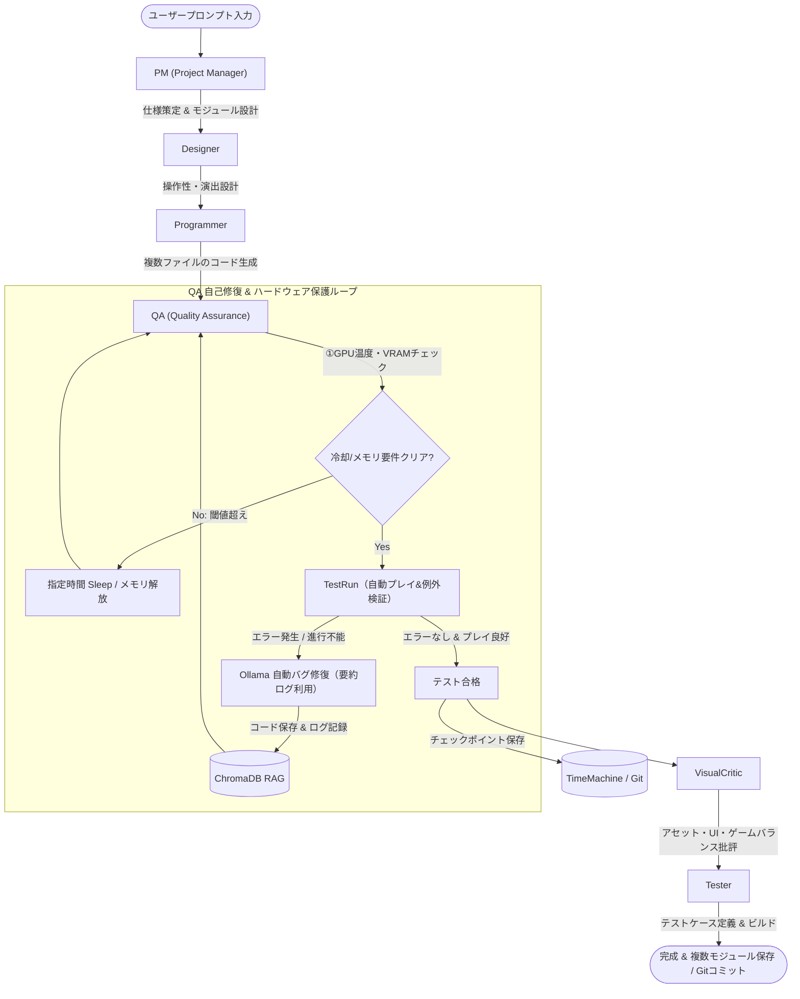

# GameStudio - AI自律型ゲーム開発統合シミュレータ環境 (IDERIA Engine v1.1)

本プロジェクトは、最先端の自律型AIエージェント群を活用してゲーム開発を行う「**開発HUD（Studio Pro Edition）**」と、ゲーム開発技術やライセンス、通信プロトコル等の知識を自律的に学習・蓄積する「**自己学習HUD（Study Edition）**」から構成される、PygameベースのAI自律型ゲーム開発統合シミュレータ環境（IDERIA Engine v1.1）です。

---

## 📐 システムアーキテクチャ (System Architecture)

### 1. 開発HUD (Studio Pro Edition) エージェント協調フロー
開発HUDでは、6人の専門家AIエージェントがバケツリレー形式でタスクを引き継ぎます。以下の「ハードウェア保護」と「複数モジュール設計」を取り入れたアップデート版の自律開発フローに従ってゲームを開発します。



### 2. 自己学習HUD (Study Edition) ナレッジ蓄積フロー
自己学習HUDは、自動および手動によるインプットから情報を抽出し、Ollama を通じて構造化された技術知識としてローカルに蓄積します。


---

## ⚠️ 設計・運用における主要課題と解決策 (Design & Operational Challenges)

システムを安定稼働させ、開発クオリティを担保するために、以下の課題分析と具体的な解決策を定義し、システム設計に組み込んでいます。

| 課題カテゴリー | 具体的な問題点 | 安定稼働のための解決策 |
| :--- | :--- | :--- |
| **1. 開発効率と精度<br>(AIの挙動制御)** | **QA修復時のハルシネーションと無限ループ**<br>ローカルLLMでバグ修復を行う際、一箇所の修正が別のバグを誘発し、ループ内で収束せずコードが破壊される。また、エラーログの累積によるコンテキスト肥大化で処理が遅延する。 | <ul><li>**ログの抽出・要約**: スタックトレースの全体ではなく、「発生したファイル名・行数・エラーの核心（末尾数行）」のみを抽出して入力。</li><li>**最小限修正（Minimal Editing）の徹底**: 「既存の正常なロジックは書き換えず、エラー発生行周辺のみをピンポイント修正する」システムプロンプトの固定。</li><li>**人間へのエスカレーション**: 3回で未解決の場合、ログを残して強制終了し、開発者に「手動修正を求める通知」を送る。</li></ul> |
| **2. ハードウェア負荷** | **サーマルスロットリングとVRAM枯渇 (OOM)**<br>複数エージェントの駆動、ChromaDBのEmbedding、Ollama推論、Pygameテストが重なるとGPU（RTX 3070/4070等）がフル稼働し、熱ダレやOOM（メモリ不足）クラッシュを起こす。 | <ul><li>**冷却パイプラインの導入**: 処理前後に `pynvml` 等でGPU温度やVRAMを監視。閾値（例: 75°C）超過時は自動で30s〜1mの冷却ウェイトを挿入。</li><li>**メモリ強制解放の徹底**: 各タスク終了時に `gc.collect()` や `torch.cuda.empty_cache()` を明示的に呼び出し解放。</li><li>**モデルの役割分担**: エージェントの複雑さに応じてモデルサイズ（8B〜32B等）や量子化（Q4_K_M等）を最適化し、展開メモリを抑制。</li></ul> |
| **3. ゲームデザイン<br>(品質・面白さ)** | **「動くクソゲー」の量産（論理評価の不足）**<br>従来の TestRun は「例外でクラッシュするか」のみを検証するため、「クリア不可能な難易度」「画面外へキャラが消失する」といった論理的破綻を検知できない。 | <ul><li>**「ゲーム性評価（Gameplay Evaluator）」**: 起動テスト時に「ランダム入力（Monkey Test）」や「シンプルな自律プレイBot」を数分間走行させる。</li><li>**テレメトリ（動作ログ）解析**: プレイ中の「スコア推移」「死亡頻度」「FPS」をJSON出力し、VisualCritic や Tester にゲームバランスを批評・修正させる。</li></ul> |
| **4. データ構造と開発単位** | **単一ファイルへの依存とクラッシュ時のデータ喪失**<br>`game_manager.py` 1ファイルに集約すると、ゲーム規模拡大時にLLMの処理可能コンテキスト制限に達し精度が低下する。また、中途クラッシュで進捗が失われる。 | <ul><li>**モジュール化（複数ファイル構成）**: PM設計段階でファイルを分割（`main.py`, `player.py`, `enemy.py`, `config.py`等）し、1回あたりのLLM修正負荷を局所化する。</li><li>**トランザクション型記録**: ループの成否ごとに、スナップショットを ChromaDB RAG および Git の一時ブランチに即時コミット保存し、いつでも復元可能にする。</li></ul> |

---

## 📂 プロジェクト構成 & 生成されるファイル

本プロジェクトは主に以下の構造で構成されています。

```text
GameStudio/
├── README.md (本ファイル)
├── requirements.txt            # 依存ライブラリ一覧
└── ai_game_studio/             # AIゲームスタジオのメインディレクトリ
    ├── README.md               # IDERIA Engine v1.1 の詳細ドキュメント
    ├── studio_pro_edition.py   # 開発HUD（Studio Pro Edition）ソースコード
    ├── studio_study_edition.py # 自己学習HUD（Study Edition）ソースコード
    ├── studio_pro_edition.spec # 開発HUDのPyInstallerビルド定義
    ├── study_mode.spec         # 自己学習HUDのPyInstallerビルド定義
    │
    ├── dist/                   # ビルド済み実行ファイル (.exe) 格納フォルダ
    │   ├── studio_pro_edition.exe
    │   └── study_mode.exe
    │
    # --- 以下は実行時に自動生成される一時・管理用ファイル ---
    ├── game_manager.py         # AIが生成・修復した最新のゲームソースコード (ホットリロード対象)
    ├── map.json                # PMエージェントが定義したゲームオブジェクトのシリアライズデータ
    ├── pygame_log.txt          # QA検証時のPygame実行例外ログ (自動デバッグに活用)
    ├── ChromaDB/               # ChromaDB (RAG) のローカル永続化データベース
    └── LearnedAssets/          # 自己学習HUDで蓄積されたレポートやPDFドキュメントの格納先
```

---

## 🛠️ 各モジュールの設計詳細

### 開発HUD: 6大エージェントの役割
1. **PM (Project Manager)**
   - 要件定義、ゲーム全体の仕様策定を行います。初期位置やオブジェクト情報を `map.json` にシリアライズする基本設計を担当します。
2. **Designer (Game Designer)**
   - ゲーム性、操作方法、演出仕様を詳細に設計し、プログラマーへ指示します。
3. **Programmer (Lead Pygame Dev)**
   - Pygameを用いた完全な実行可能Pythonスクリプトコードを実装します。アセットは指定の `Assets/Textures/ActiveAsset.png` からロードされるようにコードを構成します。
4. **QA (Quality Assurance)**
   - 生成された `game_manager.py` を実際にサブプロセスとして起動（3秒間）し、実行時例外がないか検証します。エラー発生時はOllamaにバグ内容とコードを送り自動修正を依頼します（最大3回ループ）。
5. **VisualCritic (Art Director)**
   - UIレイアウト、配色、ビジュアルエフェクトの批評を行い、必要に応じてアセット画像の生成や Pillow によるダミー画像生成を調整します。
6. **Tester (Automation Tester)**
   - 動作確認のためのテストケース策定を行い、成果物の安定性を担保します。

### RAG (ChromaDBManager)
- **ベクターDBによる知識ベース**: `chromadb` を利用してローカルの `gamedev_rag` コレクションを管理します。
- **コンテキストの注入 & 呼び出し**: Ollamaがゲームを生成する際に、過去のバグ修正履歴や開発に関する基本ナレッジを RAG コンテキストとして注入し、同様のバグの再発を防ぎます。
- **矛盾知識のクリーンアップ (`clean_contradictions`)**: バージョン変更や矛盾が生じた古いUnityやC++などの不要ナレッジを自動でフィルタリングし削除します。

### タイムマシン機能 (TimeMachine)
- **Git 連動によるチェックポイントセーブ**: ローカル環境に Git があれば自動で `git init` を行い、エージェントの各フェーズ完了時に `git commit` を実行して状態を自動保存します。
- **フォルダバックアップフォールバック**: Git がない環境でも、最大5世代のタイムスタンプ付きバックアップフォルダを生成してロールバックを可能にします。

### P2P & UPnP 通信モジュール
- **P2PConnection**: UDP ソケット（`SOCK_DGRAM`）を用いた軽量なリアルタイム通信クラス。
- **UPnP自動ポート開放**: `miniupnpc` を使用し、ルーターのポートマッピングを自動で設定（ポート開放）します。ルーター越しのP2P型マルチプレイヤー通信やデータ同期をシームレスに実現します。

### ホットリロード & プレビュー埋め込み
- **Tkinter キャンバスへの Pygame ドッキング**: `SDL_WINDOWID` 環境変数を利用して、起動した Pygame のウィンドウを Tkinter の Canvas にシームレスにドッキング表示（プレビュー）させます。
- **watchdog によるファイル監視**: ファイルの変更検知を行うとテストプロセスを自動で再起動し、リアルタイムにプレビューを更新します。

---

## 🚀 使い方と実行手順 (Usage)

### 1. 推奨環境
- **OS**: Windows 10 / 11
- **Python**: 3.10 以上
- **ローカルAI環境**: Ollama が動作しており、`llama3` モデルがプルされていること。

### 2. 依存ライブラリのインストール
以下のコマンドを実行して、必要なパッケージをインストールしてください。
```bash
pip install -r requirements.txt
```

### 3. アプリケーションの起動

#### 🎮 開発HUD (Studio Pro Edition) の起動
```bash
python ai_game_studio/studio_pro_edition.py
```
- 起動するとネオン調のサイバーパンク風GUIが立ち上がります。
- 画面中央 of テキストボックスに「作成したいゲームのプロンプト」を入力し、**[DAY MODE開始]** ボタンを押下すると、AIエージェントのバケツリレーが開始されます。

#### 📖 自己学習HUD (Study Edition) の起動
```bash
python ai_game_studio/studio_study_edition.py
```
- ユーザー指定のキーワードや、URL、PDF仕様書をドラッグ＆ドロップまたは指定して **[学習開始]** することで、AIがその技術仕様を学習しレポートを作成します。
- 生成されたレポートや資料は、自動的に `LearnedAssets/` ディレクトリに保存されます。

### 4. 実行時の主な機能コントロール

*   **言語切り替え (日本語 / English)**
    *   画面上部の言語切替ボタンから動的にUIを変更可能。英語選択時には、Ollamaへのプロンプトや出力されるソースコード、設計書もすべて英語に変更されます。
*   **軽量モード (Low-spec Mode)**
    *   チェックボックスをオンにすると、重いAIモデルのロードやGPU画像生成をスキップし、Pillowによるダミー画像生成や簡易シミュレータに切り替わります（OllamaのないPCでも一瞬で起動します）。
*   **Ollama接続監視**
    *   起動時に `127.0.0.1:11434` へ0.5秒のタイムアウトで死活確認を行います。接続できない場合は自動で「軽量モード」へとフォールバックします。
*   **緊急停止 (ABORT STUDIO / 学習停止)**
    *   実行中にトラブルが発生した際、強制停止ボタンを押すとバックグラウンドスレッドが安全に遮断され、GPUのVRAMキャッシュがパージ・解放されます。

---

## ❓ トラブルシューティング & FAQ

### Q. Ollama 接続エラーが表示される、または応答がない
Ollamaがローカルマシン上で実行されていることを確認してください。タスクバーにアイコンが表示されているか、ターミナルで `ollama run llama3` が実行可能かチェックします。
もし Ollama がインストールされていない、または起動していない場合は、シミュレータ側で自動検知され「**軽量モード**」へ自動でフォールバックします。AIによる実際のコード生成は行われませんが、疑似データを用いてシステム全体の動作確認が可能です。

### Q. UPnP (ポート自動開放) が失敗する
ご利用のルーターでUPnP（ユニバーサルプラグアンドプレイ）設定が無効になっている場合、`miniupnpc` によるポートマッピングは失敗します。この場合でもローカルネットワーク（LAN）内での通信は可能ですが、インターネット（WAN）を経由した接続を行う場合は、ルーター管理画面から手動で指定ポート（UDP）の開放設定を行ってください。

### Q. crewai や chromadb のインポートエラーが発生する
一部のライブラリ（`chromadb` や `crewai`）は、ローカル環境への導入が難しい場合に備えて、インポートできない状態でもプログラムがクラッシュしないよう、フォールバック（疑似配列処理など）が組み込まれています。ただし、RAG機能や自動デバッグ学習、高度な自律プロセスを完全な形で動作させるためには、`requirements.txt` 内のライブラリを全てインストールすることを推奨します。

### Q. Pygame のプレビュー画面がメインウィンドウにドッキングせず、別ウィンドウで起動する
OSのグラフィックス設定やSDLの相性により、`SDL_WINDOWID` によるドッキング表示が阻害される場合があります。その場合、Pygame が独立したウィンドウでポップアップ起動しますが、ゲームの動作検証や機能自体への影響はありません。

---

## 📦 ビルド方法 (PyInstallerによるシングルEXE化)

本シミュレータは、PyInstallerを使用してインストーラー不要の単一実行ファイル (.exe) にビルド可能です。

```bash
# 開発HUDのビルド
pyinstaller ai_game_studio/studio_pro_edition.spec

# 自己学習HUDのビルド
pyinstaller ai_game_studio/study_mode.spec
```
※ 各 `.spec` ファイルには `torch` や `diffusers` などの巨大パッケージを除外する `excludes` 設定があらかじめ定義されているため、軽量で高速なシングルexeが生成されます。
